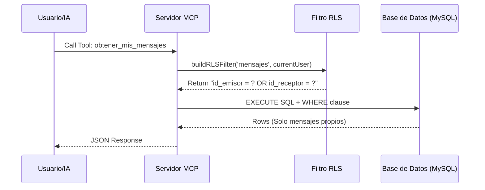

# Arquitectura y Funcionamiento: RLS y Servidor MCP

Este documento explica cómo se integran el **Protocolo de Contexto de Modelo (MCP)** y la **Seguridad a Nivel de Fila (RLS)** en este proyecto para permitir que un Agente de IA acceda a la base de datos de manera segura.

## 1. Conceptos Clave

### ¿Qué es MCP (Model Context Protocol)?
Es un estándar abierto que permite a los asistentes de IA (como Claude o IDEs con IA) conectarse a sistemas externos (bases de datos, repositorios, herramientas). En este proyecto, el **Servidor MCP** actúa como un puente que expone "herramientas" (funciones) que la IA puede invocar.

### ¿Qué es RLS (Row Level Security)?
Es una técnica de seguridad que restringe el acceso a los datos basándose en el usuario que realiza la consulta.
*   **En Bases de Datos (Nativo):** El motor (ej. PostgreSQL) filtra los datos automáticamente.
*   **En Aplicación (Nuestro Caso):** Implementamos un "Soft RLS" o filtrado lógico en el código TypeScript antes de ejecutar la consulta SQL.

---

## 2. Implementación de RLS (`src/middleware/rls.ts`)

En lugar de confiar en la base de datos para restringir el acceso, utilizamos una función auxiliar que inyecta cláusulas `WHERE` obligatorias en todas las consultas sensibles.

### Función `buildRLSFilter`
Esta función determina qué datos puede ver el usuario actual basándose en la tabla que se consulta.

```typescript
// Ejemplo simplificado de cómo funciona
export function buildRLSFilter(tabla: string, user: UserContext) {
    if (tabla === 'pedidos') {
        // Solo devuelve pedidos donde el usuario es el "cliente"
        return { clause: "id_cliente = ?", params: [user.id] };
    }
    // ... otras tablas
}
```

---

## 3. El Servidor MCP (`src/mcp/server.ts`)

El servidor define una serie de **Herramientas (Tools)** que la IA puede usar. Cada herramienta sigue un flujo estricto para garantizar la seguridad.

### Flujo de Ejecución de una Tool

1.  **Solicitud**: La IA decide llamar a una herramienta, por ejemplo, `obtener_mis_pedidos`.
2.  **Contexto**: El servidor identifica al usuario actual (`currentUser`).
3.  **Aplicación de RLS**:
    *   Antes de ejecutar cualquier SQL, el servidor llama a `buildRLSFilter('pedidos', currentUser)`.
    *   Esto devuelve un fragmento SQL (ej. `id_cliente = 15`).
4.  **Consulta Segura**:
    *   Se combina la consulta base con el filtro RLS.
    *   `SELECT * FROM pedidos`  +  `WHERE id_cliente = 15`.
5.  **Respuesta**: La base de datos devuelve solo los registros permitidos, y el servidor envía estos datos a la IA en formato JSON.

### Ejemplo de Seguridad

Si un usuario malintencionado (o una alucinación de la IA) intentara pedir "todos los pedidos", el sistema **siempre** anexa el filtro `WHERE id_cliente = ?`.

**Consulta Base:**
```sql
SELECT * FROM pedidos
```

**Consulta Ejecutada Realmente:**
```sql
SELECT * FROM pedidos WHERE id_cliente = 123 -- (123 es el ID del usuario actual)
```

---

## 4. Diagrama de Flujo



## 5. Conclusión

Esta arquitectura permite conectar una IA potente a datos privados de forma segura. La IA nunca tiene acceso directo a la tabla completa "en crudo"; siempre ve una "vista filtrada" garantizada por el middleware de RLS en el código del servidor.
